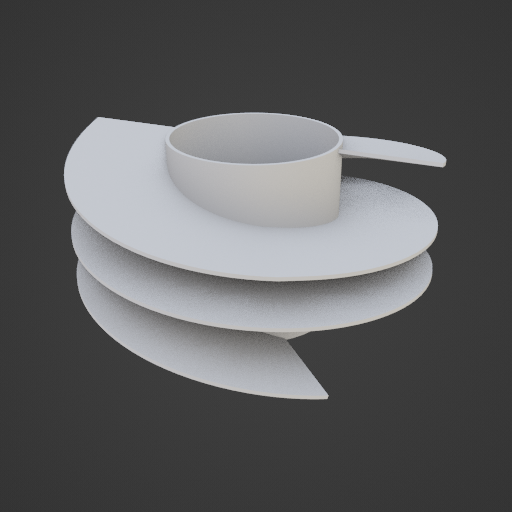
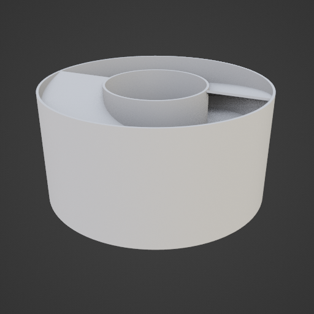

This plugin adds a mesh object which is created based on research article
"Broadband Acoustic Ventilation Barriers". 
https://www.researchgate.net/publication/340573606_Broadband_Acoustic_Ventilation_Barriers

The purpose is to cancel out audible noise in ventilation channels for a specific frequency range.
Frequency range is hardcoded for 900-1500Hz as per the proof-of-concept example in the paper.
This range is ideal for filtering for example road noise.

